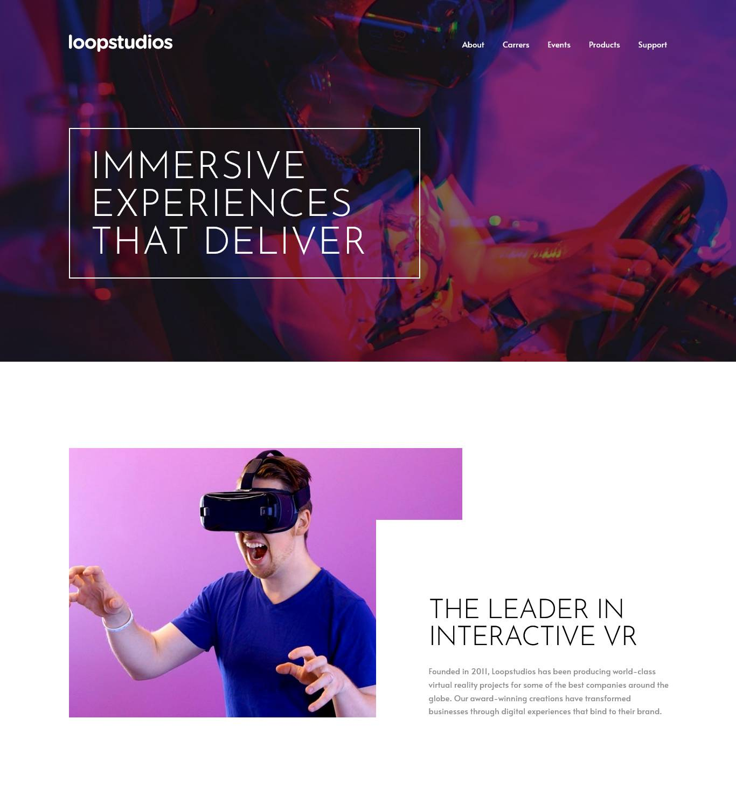

# Frontend Mentor - Loopstudios landing page solution

This is a solution to the
[Loopstudios landing page challenge on Frontend Mentor](https://www.frontendmentor.io/challenges/loopstudios-landing-page-N88J5Onjw).
Frontend Mentor challenges help you improve your coding skills by building
realistic projects.

## Table of contents

- [Overview](#overview)
  - [The challenge](#the-challenge)
  - [Screenshot](#screenshot)
  - [Links](#links)
- [My process](#my-process)
  - [Built with](#built-with)
  - [What I learned](#what-i-learned)
  - [Continued development](#continued-development)
  - [Useful resources](#useful-resources)
- [Author](#author)
- [Acknowledgments](#acknowledgments)

## Overview

### The challenge

Users should be able to:

- View the optimal layout for the site depending on their device's screen size
- See hover states for all interactive elements on the page

### Screenshot



### Links

- Solution URL: [GitHub Code](https://github.com/Herald-Flores/Loopstudios)
- Live Site URL: [Live site URL](https://herald-flores.github.io/Loopstudios/)

## My process

### Built with

- Semantic HTML5 markup
- CSS custom properties
- Flexbox
- CSS Grid
- Mobile-first workflow
- JavaScript

### What I learned

In this challenge I learned how to follow a style guide, stick to the design
proposed by the challenge, improved my skills in applying mobile first web
layout. I practiced some knowledge of HTML, CSS and JavaScript.

To see how you can add code snippets, see below:

```html
<h1>Some HTML code I'm proud of</h1>
```

```css
/* CSS Variables */
:root {
  --white: hsl(0, 0%, 100%);
  --black: hsl(0, 0%, 0%);
  --dark-gray: hsl(0, 0%, 55%);
  --very-dark-gray: hsl(0, 0%, 41%);
}
```

```js
/* JavaScript toggle hamburger menu */
const navToggler = document.querySelector('.navbar-toggler')

navToggler.addEventListener('click', () => {
  console.log('clicked')
  document.body.classList.toggle('not-scroll')
  navToggler.classList.toggle('active')
  document.querySelector('.navbar-collapse').classList.toggle('show')
})
```

### Continued development

In the next projects I will try to apply good practices of HTML, CSS and
JavaScript and even be able to use React in the frontend.

### Useful resources

- [Loopstudios landing page](https://www.frontendmentor.io/challenges/loopstudios-landing-page-N88J5Onjw) -
  The frontend mentor resorces helped me to understand the challenge and stick
  to the proposed style.

## Author

- Website - [Herald Flores](https://github.com/Herald-Flores)
- Frontend Mentor -
  [@Herald-Flores](https://www.frontendmentor.io/profile/Herald-Flores)
- Twitter - [@heraldfloresdev](https://twitter.com/heraldfloresdev)

## Acknowledgments

This solution is created with basic web development standards, no libraries or
frameworks were used for this example.
